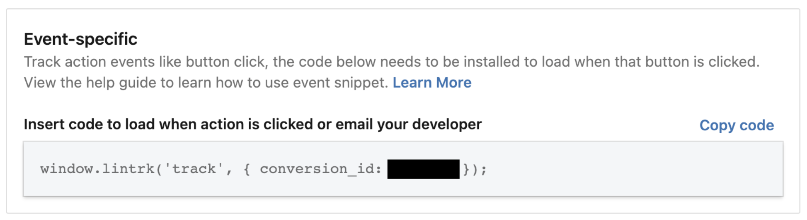

# Nextjs LinkedIn Insight Tag

**LinkedIn Insight Tag for Next.js**

This package takes advantage of the [Next.js `Script` tag](https://nextjs.org/docs/basic-features/script). Therefore, **it requires Next.js >= 11.0.0**.

## Installation

```
npm install --save nextjs-linkedin-insight-tag
```

or

```
yarn add nextjs-linkedin-insight-tag
```

## Setup

Declare you [LinkedIn partner Id](https://www.linkedin.com/help/lms/answer/a417869/access-your-linkedin-partner-id) in your `.env` file:

```
# .env

NEXT_PUBLIC_LINKEDIN_PARTNER_ID=1234
```

Or declare this variable as a [Vercel environment variable](https://vercel.com/docs/concepts/projects/environment-variables) or a [Netlify environment variable](https://docs.netlify.com/environment-variables/get-started/).

Add the `LinkedInInsightTag` component to your `pages/_app.jsx` or `pages/_app.tsx` file:

```js
// pages/_app.jsx or pages/_app.tsx
import { LinkedInInsightTag } from 'nextjs-linkedin-insight-tag'

const App = ({ Component, pageProps }) => {
  return (
    <>
      <LinkedInInsightTag />
      <Component {...pageProps} />
    </>
  );
};

export default App;
```

## Track events

If you have defined conversions in your LinkedIn Ad campaign, you need to track events:



Use `linkedInTrack` when an action takes place:

```js
// pages/some-page.jsx or pages/some-page.tsx

import { linkedInTrack } from 'nextjs-linkedin-insight-tag'

<Button
  onClick={() => {
    const conversionId = 1234;
    linkedInTrack(conversionId);
    // Actually do something...
  }}
>
  Click me!
</Button>
```

Or you may prefer to use `lintrk` directly:

```js
// pages/some-page.jsx or pages/some-page.tsx

import { lintrk } from 'nextjs-linkedin-insight-tag'

<Button
  onClick={() => {
    const conversionId = 1234;
    lintrk('track', { conversion_id: conversionId });
    // Actually do something...
  }}
>
  Click me!
</Button>
```

## License

[MIT](https://github.com/phbernard/nextjs-linkedIn-insight-tag/blob/main/LICENSE.md)
